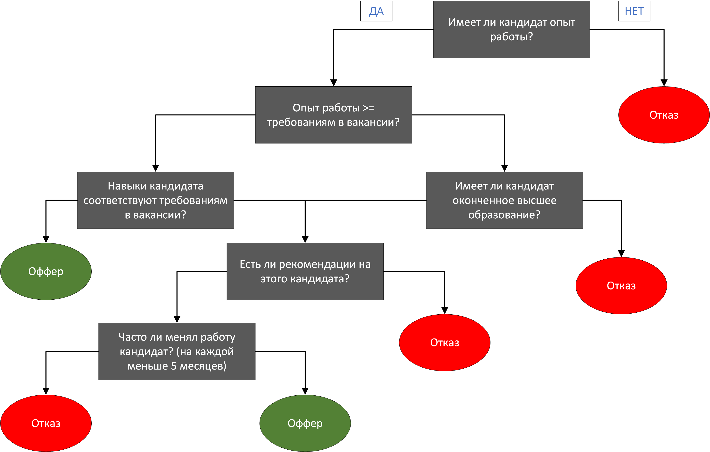

# Дерево принятия решений

### HR (хрюша) принимает решение о принятии кандидата на работу

|   #   | Вопрос                                                      | Да      | Нет     |
| :---: |-------------------------------------------------------------|---------|---------|
|   1   | Имеет ли кандидат опыт работы?                              | #2      | `Отказ` |
|   2   | Опыт работы >= требованиям в вакансии?                      | #4      | #3      |
|   3   | Имеет ли кандидат оконченное высшее образование?            | #5      | `Отказ` |
|   4   | Навыки кандидата соответствуют требованиям в вакансии?      | `Оффер` | #5      |
|   5   | Есть ли рекомендации на этого кандидата?                    | #6      | `Отказ` |
|   6   | Часто ли менял работу кандидат? (на каждой меньше 5 месяца) | `Оффер` | `Отказ` |